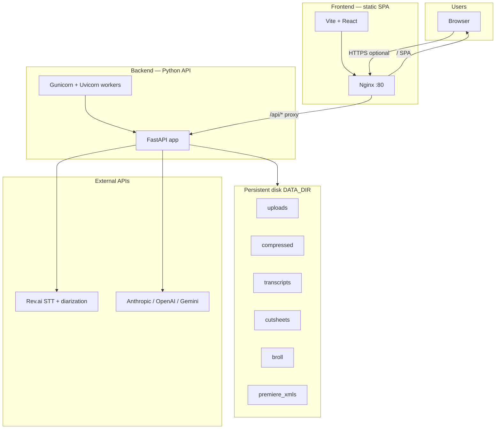

# Inside Success TV — Production Pipeline  
**Architecture, deployment, and safe change workflow**

---

## 1. High-level architecture



**Request path (Docker Compose / typical prod with same host):**

- User loads **React SPA** from Nginx (`/`).
- Browser calls **`/api/...`** → Nginx **proxies** to backend `:8000` (see `frontend/nginx.conf`).
- **Local dev:** Vite often runs on `:3000` with `vite.config.js` proxy to `localhost:8000`, or `VITE_API_URL` for a remote API.

---

## 2. Repository layout (logical)

| Area | Role |
|------|------|
| **`frontend/`** | React UI: upload, pipeline steps, transcript viewer, cut sheet / B-roll viewers, API client (`src/utils/api.js`). |
| **`backend/app/main.py`** | FastAPI app: CORS, lifespan (init HTTP clients, cleanup task), mounts routers. |
| **`backend/app/config.py`** | Paths under `DATA_DIR`, API keys, limits, `APP_VERSION`. |
| **`backend/app/routers/`** | HTTP routes: `upload`, `transcribe`, `generate`, `broll`. |
| **`backend/app/services/`** | Business logic: `audio` (FFmpeg), `revai`, `ai`, `broll`, premiere XML, etc. |
| **`backend/app/clients.py`** | Shared `httpx` client + semaphores (Rev, FFmpeg, LLM concurrency). |
| **`backend/app/cleanup.py`** | Periodic cleanup of old files under `DATA_DIR`. |
| **`docker-compose.yml`** | **backend** + **frontend** + volume **`pipeline-data`** → `/data`. |

---

## 3. Main data flow (Editor cut sheet pipeline)

1. **Upload** — Chunked/large file → `uploads/` (see `upload` router).
2. **Prepare for Rev** — If upload is **larger than `COMPRESS_AUDIO_ABOVE_MB`** (default **200 MB**), FFmpeg → mono 16 kHz MP3 @ 64k → `compressed/`. **At or below** that size, the file is **copied** as-is (no re-encode) to save time; tune via env.
3. **Transcribe** — Submit to **Rev.ai** (diarization on) → poll → transcript JSON → `transcripts/` + normalized **sentences + speakers**.
4. **Generate** — LLM (provider/model from UI) → cut sheet → `cutsheets/`.
5. **Export** — Optional Premiere XML paths under `premiere_xmls/` as applicable.

**B-roll pipeline** reuses upload/transcript steps, then **`broll`** router + prompts → `broll/`.

---

## 4. External dependencies

| Service | Purpose | Config |
|---------|---------|--------|
| **Rev.ai** | Async speech-to-text + speaker diarization | `REV_AI_TOKEN` |
| **Anthropic / OpenAI / Gemini** | Cut sheet & B-roll generation | `ANTHROPIC_API_KEY`, etc. |
| **FFmpeg** | Installed in backend image / host | Used by `services/audio.py` |
| **Pexels** (if used) | Stock-related features | `PEXELS_API_KEY` |

---

## 5. Deployment — what you need

### 5.1 Infrastructure checklist

- **Host** that can run **Docker** (or two processes: Python API + static files + reverse proxy).
- **Persistent volume** for **`DATA_DIR`** (uploads, transcripts, outputs). **Do not deploy without persistence** or users lose work on restart.
- **Secrets** (never commit): `.env` or platform secret manager — at minimum:
  - `REV_AI_TOKEN`
  - One or more LLM keys
  - Optional: `CORS_ORIGINS`, `APP_VERSION`
- **CORS:** Set `CORS_ORIGINS` to your real frontend origin(s) in production (avoid `*` if cookies/auth added later).
- **Body size / timeouts:** Large uploads and long LLM calls need generous **proxy read/send timeouts** (nginx already high for `/api/`; adjust load balancer similarly).
- **Health checks:** `GET /api/health` returns `version` — use for orchestrator health + the UI version banner logic.

### 5.2 Docker Compose (simplest full stack)

```bash
# backend/.env populated with keys
docker compose up --build -d
```

- Frontend: **`http://host:3000`** → Nginx → static + `/api/` → backend.
- Backend: internal **`8000`**, mapped **`8000:8000`** in compose file.

### 5.3 Common platforms

| Platform | Notes |
|----------|--------|
| **VPS + Docker** | Same as compose; add TLS (Caddy / Traefik / nginx). |
| **Render / Fly / Railway** | Mount **disk** for `DATA_DIR`; set env vars; may split frontend (static) + backend (web service). |
| **AWS / GCP** | S3/GCS optional for files instead of local disk (would require code changes). |

### 5.4 Recommended split: Vercel + Render

- **Frontend**: Deploy `frontend/` to **Vercel** (Vite static build).
  - Set `VITE_API_URL=https://<your-render-service>.onrender.com`
  - Keep SPA rewrite (`frontend/vercel.json`).
- **Backend**: Deploy via **Render Blueprint** (`render.yaml`).
  - Service uses `backend/Dockerfile` with Gunicorn/Uvicorn.
  - Persistent disk mounted at `/data`.
  - Set `CORS_ORIGINS` to your Vercel domain.
  - Tune `COMPRESS_AUDIO_ABOVE_MB` (default 200) to control FFmpeg skip/compress behavior.

---

## 6. How to change the tool **without** disturbing production

Use a **tiered** workflow: **local → staging → production**.

### 6.1 Branching

- **`main` (or `production`)** — only what is deployed to prod.
- **Feature branches** — `feature/…`, `fix/…` — merge via PR.
- Optional: **`staging`** branch — auto-deploys to a staging URL.

### 6.2 Environments

| Environment | Purpose |
|-------------|---------|
| **Local** | `npm run dev` + `uvicorn --reload`; own `.env`; safe to break. |
| **Staging** | Same Docker stack as prod, separate URL, **separate** `DATA_DIR` / keys optional; test full upload → Rev → LLM once before prod. |
| **Production** | Frozen-ish; deploy only tagged releases or merged PRs. |

### 6.3 Safe deployment practices

1. **Bump `APP_VERSION`** (env or constant) on each release — frontend can show “new version available” when it differs from `/api/health`.
2. **Database/files:** You’re file-based; backups = **snapshot the volume** or sync `DATA_DIR` per policy.
3. **Rolling updates:** Gunicorn **graceful timeout** helps in-flight requests; avoid killing containers mid-upload (use health checks + drain).
4. **Backward compatibility:** When changing API response shapes, either **version the API** (`/api/v2/…`) or keep old fields until the new UI is fully rolled out.
5. **Feature flags (optional):** For risky UI, a simple env `FEATURE_BROLL_V3=true` on staging first — no need for a heavy system early on.

### 6.4 What to change where (quick map)

| Change | Where |
|--------|--------|
| UI copy, steps, toggles | `frontend/src` |
| API URL in dev | `frontend/vite.config.js`, `VITE_API_URL` |
| Transcription provider | `backend/app/services/revai.py` + `routers/transcribe.py` |
| LLM prompts / models | `backend/app/services/ai.py`, `broll_prompt_v2.py`, routers |
| Limits, paths, keys | `backend/app/config.py`, `.env` |
| Nginx / upload size / proxy | `frontend/nginx.conf`, platform LB |
| Worker count / timeouts | `backend/Dockerfile` `gunicorn` args |

### 6.5 Testing before prod

- **Smoke:** `backend/scripts/load_test_pipeline.py` (modes documented in `backend/scripts/README-loadtest.md`).
- **Manual:** One full path on **staging** (upload → compress → Rev → generate).

---

## 7. Security notes (production)

- Use **HTTPS** in front of Nginx.
- Rotate API keys; scope Rev/LLM keys to minimum needed.
- `client_max_body_size` and rate limiting at edge if public internet.

---

## 8. Summary

- **Stack:** React SPA + Nginx + **FastAPI** backend + **Gunicorn/Uvicorn** + **FFmpeg** + **Rev.ai** + **LLM APIs** + **local disk** under `DATA_DIR`.
- **Deploy:** Container(s), persistent volume, secrets, CORS, long timeouts for big files and AI.
- **Safe changes:** Feature branches → staging → prod; version health endpoint; avoid breaking API without migration; backup `DATA_DIR`.

For questions specific to your host (e.g. Render vs VPS), adapt section 5.3 only — the architecture above stays the same.
